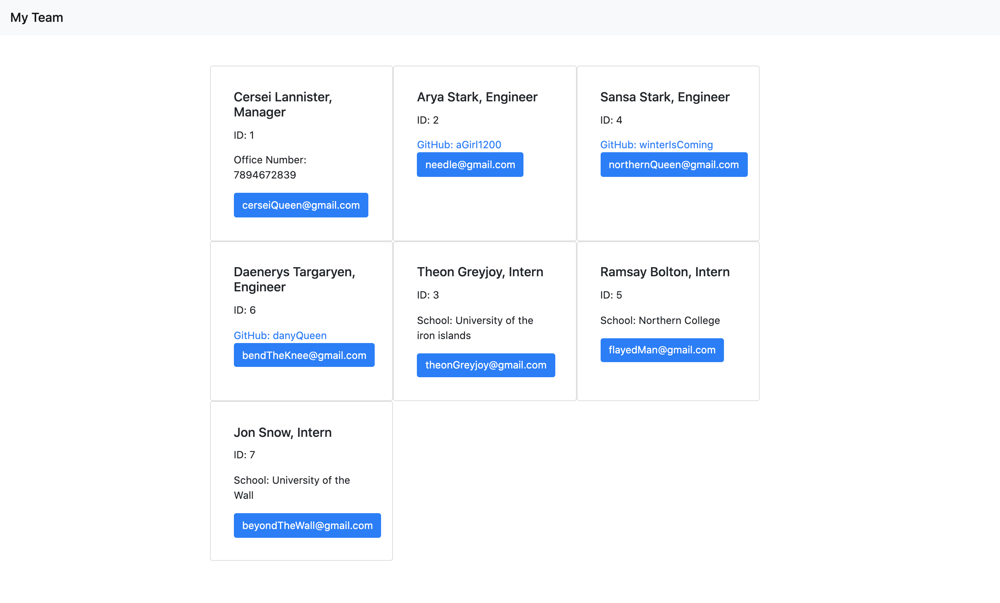

# Team Contact Information Generator

## Description 
The client will use this command line application to generate a list of contacts 
for their team output in an html file format. When clicked, the GitHub 
account for the Engineer will be populated. The user will also be able 
to send an email to any team member with their default email service. 
A screenshot of the intended output is shown below.

## Installation
This application requires the installation of the Node Package Manager. Prior to use, run `npm install`

## Usage
To start the application run `node index.js`
A walkthrough video of the application's functionality can be found here https://drive.google.com/file/d/1DQCqmbOBhMK6RYoIsELhL_Em9eqA1xBc/view

## Testing
This application was developed using test driven development via Jest. Simlp run `npm run test` to show that all tests pass.

## License
MIT
